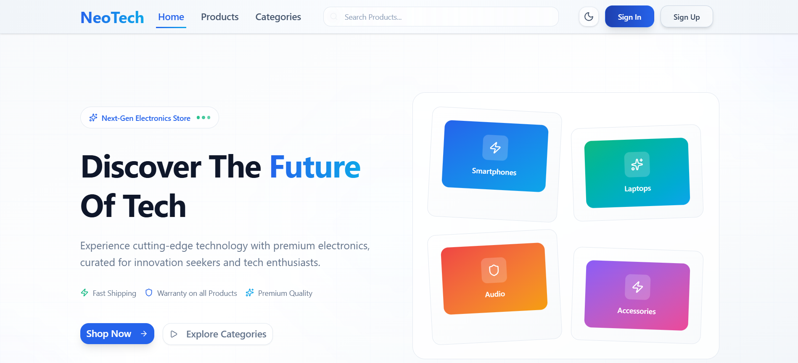

<h1 align="center" id="title">NeoTech</h1>

<p align="center"></p>

<p id="description">Neotech is a full-stack e-commerce platform where users can browse buy and review products with ease. The platform supports product management category browsing filtering sorting and advanced checkout features powered by MongoDB for data handling. <br><br> The platform also includes a dedicated admin dashboard for managing users products categories orders and reviews making it easy to oversee all aspects of the e-commerce ecosystem. Payments are seamlessly integrated with Stripe enabling secure transactions for payment. <br><br>Built entirely with TypeScript Neotech features following  stack:<strong> React.js + Tailwind CSS + shadcn/ui </strong> on the frontend and <strong> Node.js + Express.js + MongoDB </strong>on the backend , containerized using <strong>Docker</strong> and  deployment on Vercel (frontend) and Railway/AWS/DigitalOcean (backend).</p>

<p align="center"></p>

<h2>🚀 Demo</h2>

[https://neotech-six.vercel.app/](https://neotech-six.vercel.app/)

<h2>🧐 Features</h2>

Here're some of the project's best features:

- Browse search filter and sort products by category price range name and so on
- Add products to cart wishlist and purchase using Stripe Payment method
- Submit product reviews and ratings after purchase
- View carts wishlists past orders and track their status
- Admin dashboard for managing users products categories orders reviews and analytics

<h2>💻 Built with</h2>

Technologies used in the project:

- Frontend – React.js + TypeScript + TailwindCSS + shadcn/ui components
- Backend – Node.js + Express.js + TypeScript + MongoDB + Mongoose
- Authentication – JWT
- Payments – Stripe API
- Deployments – Vercel (Frontend) + Railway (Backend)
- Containerization - Docker


<h2>📚 API Documentation</h2>

You can view the full API documentation [View API Documentation](./API_DOCS.md)


<h2>Folder Structure</h2>

```
Neotech/
├── backend/
│   ├── dist/
│   ├── node_modules/
│   ├── src/
│   │   ├── configs/
│   │   ├── controllers/
│   │   ├── middlewares/
│   │   ├── models/
│   │   ├── routes/
│   │   ├── services/
│   │   ├── types/
│   │   ├── utils/
│   │   ├── validators/
│   │   ├── app.ts
│   │   └── index.ts
│   ├── .dockerignore
│   ├── .env
│   ├── Dockerfile
│   ├── package-lock.json
│   └── package.json
|   └── tsconfig.json
├── frontend/
│   ├── dist/
│   ├── node_modules/
│   ├── public/
│   ├── src/
│   │   ├── components/
│   │   ├── context/
│   │   ├── features/
│   │   ├── hooks/
│   │   ├── lib/
│   │   ├── pages/
│   │   ├── routes/
│   │   ├── store/
│   │   ├── types/
│   │   ├── App.css
│   │   ├── App.tsx
│   │   └── main.tsx
│   ├── .dockerignore
│   ├── .env
│   ├── .gitignore
│   ├── components.json
│   ├── Dockerfile
│   ├── eslint.config.js
│   ├── index.html
│   ├── package-lock.json
│   ├── package.json
│   ├── README.md
│   ├── tsconfig.app.json
│   ├── tsconfig.json
│   ├── tsconfig.node.json
│   └── vite.config.ts
├── .gitignore
├── API_DOCS.md
├── docker-compose.yaml
└── README.md
```

<h2>Project Snapshots</h2>

You can view some project snapshots [here](./frontend/public/).

<h2>🛡️ License:</h2>

This project is licensed under the MIT
